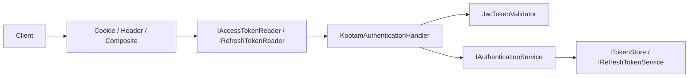

# Authentication Extension

Modular authentication with pluggable token transport, JWT generation, and refresh-token storage backends.

| Package | Purpose |
|---------|---------|
| `Kootam.Authentication.Abstractions` | Contracts |
| `Kootam.Authentication` | Core auth handler, cookie/header/composite transport |
| `Kootam.Authentication.Jwt` | JWT token generation & validation |
| `Kootam.Authentication.SqlServer` | Refresh tokens in SQL Server (EF Core) |
| `Kootam.Authentication.Redis` | Refresh tokens in Redis |
| `Kootam.Authentication.InMemory` | In-memory token store (dev/WIP) |

**Samples:**
- `Extensions/Authentication/Kootam.Authentication/src/Kootam.Authentication.Sample/`
- `Extensions/Authentication/Kootam.Authentication.Jwt/src/Kootam.Authentication.Jwt.Sample/`
- `Extensions/Authentication/Kootam.Authentication.SqlServer/src/Kootam.Authentication.SqlServer.Sample/`

---

## Architecture



---

## Core Registration

```csharp
using Kootam.Authentication.DependencyInjection;

builder.Services
    .AddKootamAuthentication("AppScheme")   // or AddKootamAuthentication() for default "KootamScheme"
    .UseCookies();                          // transport (see below)

builder.Services.AddCurrentUser();          // ICurrentUserAccessor
```

`AddKootamAuthentication` registers:

- `IPasswordHasherService`
- `IAuthenticationService<TUserKey>`
- ASP.NET Core authentication scheme with `KootamAuthenticationHandler`

---

## Token Transport

Choose **one** transport (or composite):

| Method | Extension | Use case |
|--------|-----------|----------|
| `UseCookies()` | Cookie transport | SPA / browser apps |
| `UseAuthorizationHeader()` | Bearer header | Mobile / API clients |
| `UseComposite()` | Cookie + header readers | Mixed clients |

```csharp
// Cookie-based (default for web)
builder.Services.AddKootamAuthentication("AppScheme").UseCookies();

// Authorization header only
builder.Services.AddKootamAuthentication("AppScheme").UseAuthorizationHeader();

// Both cookie and header
builder.Services.AddKootamAuthentication("AppScheme").UseComposite();
```

Configure transport options via `AuthenticationTransportOption` when needed.

---

## JWT

Add after `AddKootamAuthentication`:

```csharp
using Kootam.Authentication.Jwt.DependencyInjection;

builder.Services
    .AddKootamAuthentication("AppScheme")
    .UseCookies()
    .AddJwt(builder.Configuration);   // binds "Jwt" section
```

**appsettings.json:**

```json
{
  "Jwt": {
    "Key": "your-secret-key-min-32-chars",
    "Issuer": "Kootam",
    "Audience": "KootamApi",
    "AccessTokenExpirationMinutes": 15,
    "RefreshTokenExpirationDays": 7
  }
}
```

Or configure inline:

```csharp
.AddJwt(options =>
{
    options.Key = "your-secret-key";
    options.Issuer = "Kootam";
    options.Audience = "KootamApi";
})
```

Registers: `ITokenValidator`, `IAuthenticateHandler`, `ITokenGenerator<,>`.

---

## Refresh Token Storage

### SQL Server

```csharp
using Kootam.Authentication.SqlServer.DependencyInjection;

builder.Services.AddRefreshTokenSql();
```

Requires a DbContext implementing `IRefreshTokenDbContext`. Registers `IRefreshTokenService<>` and `IRefreshTokenRepository<>`.

### Redis

```csharp
using Kootam.Authentication.Redis.DependencyInjection;

builder.Services
    .AddKootamAuthentication("AppScheme")
    .UseCookies()
    .AddRefreshTokenRedis();
```

---

## User Claims Mapping

Implement `IUserClaimsMapper<TUser>` to map your user model to claims:

```csharp
builder.Services.AddScoped<IUserClaimsMapper<AppUser>, AppUserClaimsMapper>();
```

Reference: `Kootam.Authentication.Jwt.Sample/Mappers/LoggingUserClaimsMapper.cs`

---

## Current User

```csharp
builder.Services.AddCurrentUser();
```

Inject `ICurrentUserAccessor` to read the authenticated user in handlers/services.

Pair with `Kootam.UserManagement.Abstractions.IUserInfoService` for richer user context — see [user-management.md](./user-management.md).

---

## Sign In / Sign Out

```csharp
public class AuthController(IAuthenticationService<long> authService) : ControllerBase
{
    [HttpPost("login")]
    public async Task<IActionResult> Login(LoginRequest request)
    {
        // Validate credentials, generate token via ITokenGenerator
        var token = new IssuedToken<long> { /* ... */ };
        await authService.SignInAsync(token);
        return Ok();
    }

    [HttpPost("logout")]
    public async Task<IActionResult> Logout()
    {
        await authService.SignOutAsync();
        return Ok();
    }
}
```

---

## Full Example (JWT + Cookies)

```csharp
builder.Services.AddScoped<IUserClaimsMapper<AppUser>, AppUserClaimsMapper>();
builder.Services.AddScoped<IUserInfoService, AppUserInfoService>();

builder.Services
    .AddKootamAuthentication("AppScheme")
    .UseCookies()
    .AddJwt(builder.Configuration);

builder.Services.AddRefreshTokenSql();   // or AddRefreshTokenRedis()
builder.Services.AddCurrentUser();
```

---

## Agent Rules

- Always chain transport **before** JWT: `.AddKootamAuthentication(...).UseCookies().AddJwt(...)`.
- Never hardcode JWT secrets — use configuration / secrets manager.
- Use `IUserClaimsMapper<TUser>` for claim mapping; do not manually build `ClaimsPrincipal` in controllers.
- Pick one refresh-token backend (SQL or Redis), not both.
- Protect endpoints with `[Authorize]` after `app.UseAuthentication(); app.UseAuthorization();`.
