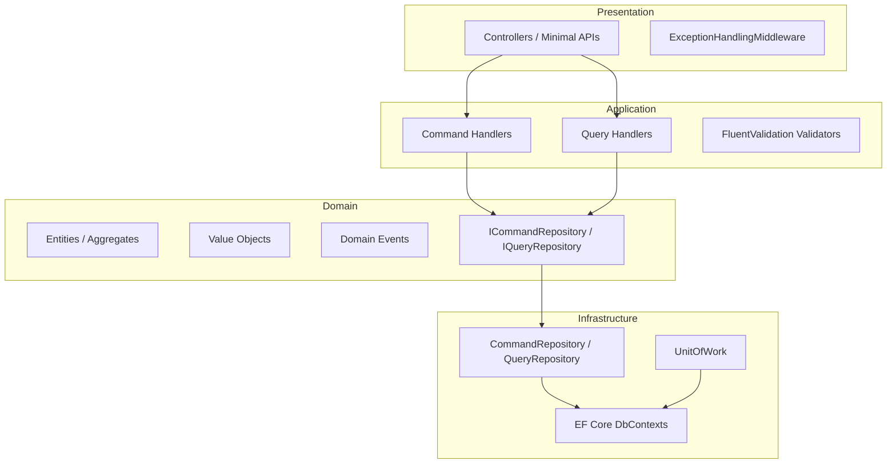

# Kootam.Framework

Backend framework for building .NET services using **Clean Architecture**, **Domain-Driven Design (DDD)**, and **CQRS**.

This document is the primary reference for **backend developers** and **AI agents** implementing services on top of Kootam.Framework. Follow the conventions, layer boundaries, and patterns described here.

---

## Tech Stack

| Component | Version |
|-----------|---------|
| .NET | 10.0 (`net10.0`) |
| Entity Framework Core | 10.0.x |
| FluentValidation | 12.x |
| ASP.NET Core | Minimal APIs / MVC |

Local NuGet packages are restored from `./nugets` (see `nuget.config`).

---

## Architecture Overview



**Dependency rule:** outer layers depend on inner layers. Domain has zero infrastructure references.

---

## Repository Structure

```
Kootam.Framework/
├── Application/          # Application services, grid queries, shared app logic
├── Common/               # Shared abstractions, utilities, API response types
├── Domain/               # Entities, aggregates, value objects, domain contracts
├── Infrastructure/       # EF Core, repositories, interceptors, seeding
├── Presentations/        # Base controllers, middleware, host extensions
├── Extensions/           # Optional packages (CQRS, Auth, Caching, MessageBroker, …)
├── nugets/               # Local NuGet feed output
├── script/               # Pack & update scripts (win / linux)
└── Kootam.Framework.slnx # Core framework solution
```

### Core NuGet Packages (this repo)

| Package | Purpose |
|---------|---------|
| `Kootam.Framework.Domain` | Entities, aggregates, value objects, repository contracts |
| `Kootam.Framework.Abstractions` | Shared query abstractions (`IPageQuery`, `IHasId`) |
| `Kootam.Framework.Application` | Grid filtering, application-level query helpers |
| `Kootam.Framework.Infrastructure` | EF Core base contexts, repositories, unit of work |
| `Kootam.Framework.Presentations` | `BaseCqrsController`, exception middleware, migrations helper |
| `Kootam.Framework.Utilities` | `ApiResponse`, validation helpers, common exceptions |

**Common package documentation:** [Common/docs/README.md](Common/docs/README.md)

### Extension Packages (`Extensions/`)

| Area | Packages |
|------|----------|
| **CQRS** | `Kootam.Cqrs`, `Kootam.Cqrs.Abstractions` |
| **Authentication** | `Kootam.Authentication`, `Kootam.Authentication.Jwt`, `Kootam.Authentication.SqlServer`, `Kootam.Authentication.Redis`, `Kootam.Authentication.InMemory` |
| **Caching** | `Kootam.Caching.InMemory`, `Kootam.Caching.Redis`, `Kootam.Caching.Sql` |
| **Message Broker** | `Kootam.MessageBroker.RabbitMQ`, `Kootam.MessageBroker.Kafka`, `Kootam.MessageBroker.AzureServiceBus` |
| **Auto Mapping** | `Kootam.AutoMap.AutoMapper`, `Kootam.AutoMap.Mapster` |
| **Translation** | `Kootam.Translator.Json`, `Kootam.Translator.Database` |
| **User Management** | `Kootam.UserManagement` |
| **Observability** | `Kootam.Utilities.SerilogRegistration`, `Kootam.Utilities.ScalarRegistration` |

Each extension includes a `*.Sample` project demonstrating usage.

**Full extension documentation:** [Extensions/docs/README.md](Extensions/docs/README.md)

---

## Domain Layer Conventions

### Entities and Aggregates

- **`BaseEntity<TKey>`** — base for all entities. Provides `Id` and `BusinessId` (a `Guid`-backed value object).
- **`AggregateRoot<TKey>`** — use for write-model roots. Supports domain events via `Apply()` / `On()` pattern.
- Default key type is `long` (`BaseEntity`, `AggregateRoot`).

```csharp
public class Product : AggregateRoot
{
    public string Name { get; private set; }

    private Product() { }

    public static Product Create(string name)
    {
        var product = new Product { Name = name };
        product.Apply(new ProductCreatedEvent(product.BusinessId));
        return product;
    }

    private void On(ProductCreatedEvent e) { /* mutate state */ }
}
```

### Auditing & Capabilities

Implement marker/capability interfaces when needed:

| Interface | Purpose |
|-----------|---------|
| `IFullAuditedAggregateRoot<TKey>` | Creation + modification audit + soft delete |
| `ISoftDelete` | Logical delete support |
| `IHasConcurrencyStamp` | Optimistic concurrency |
| `IMultiTenant` / `IMultiTenantEntity` | Tenant isolation |

### Value Objects

Extend `BaseValueObject<T>`. Example: `BusinessId` wraps a `Guid` with validation.

### Repository Contracts

- **`ICommandRepository<TEntity, TKey>`** — write side (aggregates only).
- **`IQueryRepository<TEntity, TKey>`** — read side (any entity/DTO projection).
- **`IUnitOfWork`** — transaction boundaries (`BeginTransaction`, `CommitTransaction`, `ExecuteInTransactionAsync`).

---

## Application Layer (CQRS)

### Commands

```csharp
public record CreateProductCommand(string Name) : IRequest<Guid>;

public class CreateProductCommandHandler(
    ICommandRepository<Product, long> repository,
    IUnitOfWork unitOfWork)
    : IRequestHandler<CreateProductCommand, Guid>
{
    public async Task<Result<Guid>> Handle(CreateProductCommand command, CancellationToken ct)
    {
        var product = Product.Create(command.Name);
        await repository.AddAsync(product, ct);
        await unitOfWork.CommitTransactionAsync(ct);
        return Result<Guid>.Success(product.BusinessId.Value);
    }
}
```

### Queries

```csharp
public record GetProductListQuery : IQuery<List<ProductDto>>;

public class GetProductListQueryHandler(IQueryRepository<Product, long> repository)
    : IQueryHandler<GetProductListQuery, List<ProductDto>>
{
    public async Task<Result<List<ProductDto>>> Handle(GetProductListQuery query, CancellationToken ct)
    {
        var items = await repository.GetAllAsync(ct);
        return Result<List<ProductDto>>.Success(items.Select(p => new ProductDto(p.Name)).ToList());
    }
}
```

### Validation

Use FluentValidation. Validators are auto-registered when CQRS validation is enabled:

```csharp
public class CreateProductCommandValidator : AbstractValidator<CreateProductCommand>
{
    public CreateProductCommandValidator()
    {
        RuleFor(x => x.Name).NotEmpty();
    }
}
```

### Paging

Use `IPageQuery<T>` / `PageQuery<T>` from `Kootam.Framework.Abstractions` for paginated queries.

Use `IGridFilterQuery` from `Kootam.Framework.Application` for dynamic grid filtering/sorting.

---

## Infrastructure Layer

### DbContext Setup

Inherit from the base contexts:

| Base Class | Use Case |
|------------|----------|
| `BaseCommandDbContext<TContext>` | Write model (commands, migrations) |
| `BaseQueryDbContext<TContext>` | Read model (queries, can be separate DB) |
| `BaseDbContext<TContext>` | Shared EF configuration |

```csharp
public class AppCommandDbContext(DbContextOptions<AppCommandDbContext> options)
    : BaseCommandDbContext<AppCommandDbContext>(options)
{
    public DbSet<Product> Products => Set<Product>();

    protected override IEnumerable<IModelConfiguration> ModelConfigurations =>
        [new ProductConfiguration()];
}
```

Implement `IModelConfiguration` for fluent entity configuration instead of inline `OnModelCreating` logic.

### Repositories

Register generic repositories in DI:

```csharp
services.AddScoped(typeof(ICommandRepository<,>), typeof(CommandRepository<,,>));
services.AddScoped(typeof(IQueryRepository<,>), typeof(QueryRepository<,,>));
services.AddScoped<IUnitOfWork, UnitOfWork<AppCommandDbContext>>();
```

### Database Initialization

```csharp
// Option A: seed via IDbInitializer
builder.Services.AddDatabaseInitializer<AppCommandDbContext>();

// Option B: migrate + seed on startup
await app.MigrateDatabaseAsync<AppCommandDbContext>(async (context, sp) =>
{
    // seed logic
});
```

---

## Presentation Layer

### Base Controllers

Inherit from **`BaseCqrsController`** for CQRS-backed endpoints:

```csharp
[Route("api/[controller]")]
public class ProductsController : BaseCqrsController
{
    [HttpPost]
    public Task<IActionResult> Create(CreateProductCommand command)
        => Create(command);

    [HttpGet]
    public Task<IActionResult> GetList()
        => Query(new GetProductListQuery());
}
```

`BaseCqrsController` dispatches commands/queries and maps `Result<T>` to HTTP responses via `ApiResponseExtensions`.

### Exception Handling

Register `ExceptionHandlingMiddleware` to return standardized `ApiResponse` on unhandled errors.

### API Response Shape

All responses use `ApiResponse` / `ApiResponse<T>`:

```json
{
  "success": true,
  "statusCode": 200,
  "message": null,
  "data": { }
}
```

---

## Bootstrapping a New Backend Service

Recommended project layout for a consuming service:

```
MyService/
├── src/
│   ├── MyService.Domain/
│   ├── MyService.Application/
│   ├── MyService.Infrastructure/
│   └── MyService.Api/
└── tests/
    └── MyService.Tests/
```

### Step-by-step

1. **Create projects** targeting `net10.0`.
2. **Reference packages** from NuGet (local `./nugets` or published feed):
   - Domain → `Kootam.Framework.Domain`
   - Application → `Kootam.Framework.Application`, `Kootam.Cqrs`
   - Infrastructure → `Kootam.Framework.Infrastructure`
   - API → `Kootam.Framework.Presentations`
3. **Define aggregates** in Domain.
4. **Add commands, queries, handlers, validators** in Application.
5. **Configure DbContext, repositories, DI** in Infrastructure.
6. **Wire up Program.cs**:

```csharp
var builder = WebApplication.CreateBuilder(args);

builder.Services.AddControllers();
builder.Services.AddOpenApi();

// DbContext
builder.Services.AddDbContext<AppCommandDbContext>(options =>
    options.UseSqlServer(builder.Configuration.GetConnectionString("Default")));

// Repositories & UoW
builder.Services.AddScoped(typeof(ICommandRepository<,>), typeof(CommandRepository<,,>));
builder.Services.AddScoped<IUnitOfWork, UnitOfWork<AppCommandDbContext>>();

// CQRS
builder.Services.AddCqrs(options =>
{
    options.RegisterServicesFromAssemblyContaining<CreateProductCommandHandler>();
    options.EnableValidation = true;
    options.EnableLogging = true;
});

// Optional: Authentication
builder.Services.AddKootamAuthentication("AppScheme").UseCookies();

var app = builder.Build();

app.UseMiddleware<ExceptionHandlingMiddleware>();
app.MapControllers();
await app.MigrateDatabaseAsync<AppCommandDbContext>();

app.Run();
```

---

## Optional Extensions

### Authentication

```csharp
builder.Services.AddKootamAuthentication("AppScheme")
    .UseCookies();          // cookie-based refresh tokens
    // .UseComposite();      // multiple token readers

builder.Services.AddCurrentUser();
```

JWT, SQL Server, Redis, and InMemory token stores are available as separate packages.

### Caching

Choose one backend and register via its `ServiceCollection` extension:

- `Kootam.Caching.InMemory`
- `Kootam.Caching.Redis`
- `Kootam.Caching.Sql`

### Message Broker

Publish/subscribe via abstractions in `Kootam.MessageBroker.Abstractions`. Implementations: RabbitMQ, Kafka, Azure Service Bus.

### Auto Mapping

Pick one adapter:

- `Kootam.AutoMap.AutoMapper`
- `Kootam.AutoMap.Mapster`

---

## Build & Pack

### Restore & Build

```powershell
dotnet restore Kootam.Framework.slnx
dotnet build Kootam.Framework.slnx -c Release
```

### Pack Local NuGet Packages

**Windows:**

```powershell
.\script\win\Pack-Kootam.Framework.ps1   # core framework
.\script\win\Pack-Kootam.Abstractions.ps1
.\script\win\Pack-Extensions.ps1          # all extensions
```

**Linux:**

```bash
./script/linux/Pack-Kootam.Framework.sh
./script/linux/Pack-Kootam.Abstractions.sh
./script/linux/Pack-Extensions.sh
```

Output goes to `./nugets/`. Consuming projects must reference this folder via `nuget.config`.

---

## Sample Projects (Reference Implementations)

| Sample | Location | Demonstrates |
|--------|----------|--------------|
| CQRS | `Extensions/Cqrs/Kootam.Cqrs/src/Kootam.Cqrs.Sample/` | Commands, queries, validators, controllers |
| Authentication | `Extensions/Authentication/Kootam.Authentication/src/Kootam.Authentication.Sample/` | Cookie auth setup |
| JWT Auth | `Extensions/Authentication/Kootam.Authentication.Jwt/src/Kootam.Authentication.Jwt.Sample/` | JWT token flow |
| Caching | `Extensions/Chaching/*/src/*.Sample/` | InMemory, Redis, SQL caching |
| Message Broker | `Extensions/MessageBroker/*/src/*.Sample/` | RabbitMQ, Kafka |
| Translator | `Extensions/Translator/*/src/*.Sample/` | JSON & database translation |

Always consult the relevant `*.Sample` project before implementing a new integration.

---

## Guidelines for AI Agents

When implementing backend features in a Kootam-based service:

### Do

- Place **entities and domain logic** in the Domain project only.
- Use **`AggregateRoot`** for write-model roots; raise domain events inside aggregates.
- Return **`Result<T>`** from all command/query handlers — never throw for expected business failures.
- Add **FluentValidation validators** for every command that accepts user input.
- Use **`BaseCqrsController`** helper methods (`Create`, `Update`, `Delete`, `Query`) in controllers.
- Follow existing **naming conventions**: `{Action}{Entity}Command`, `{Action}{Entity}Query`, `{Name}Handler`, `{Name}Validator`.
- Use **`BusinessId`** for external-facing identifiers; keep `Id` as internal PK.
- Register handlers via **`AddCqrs`** assembly scanning.
- Match **.NET 10** and **EF Core 10** APIs.

### Do Not

- Do not reference Infrastructure or EF Core from Domain or Application.
- Do not put business logic in controllers — controllers dispatch only.
- Do not bypass `IUnitOfWork` for transactional command handlers.
- Do not use `ICommandRepository` for non-aggregate entities.
- Do not introduce new response envelope formats — use `ApiResponse<T>`.
- Do not add unrelated abstractions or over-engineer; follow existing patterns in the codebase.

### File Placement Checklist

| Artifact | Project |
|----------|---------|
| Entity / Aggregate / Value Object / Domain Event | `{Service}.Domain` |
| Command, Query, Handler, Validator | `{Service}.Application` |
| DbContext, Repository, Configuration, Seeder | `{Service}.Infrastructure` |
| Controller, Program.cs, Middleware registration | `{Service}.Api` |

---

## Common Exceptions

| Exception | When to Use |
|-----------|-------------|
| `NotExistsException` | Entity not found |
| `DuplicatedRecordException` | Unique constraint violation |
| `InvalidEntityStateException` | Invalid aggregate state transition |
| `InvalidValueObjectStateException` | Value object validation failure |
| `ValidationException` (Application) | Application-level validation errors |

---

## Author

Behnam Hadipanah
